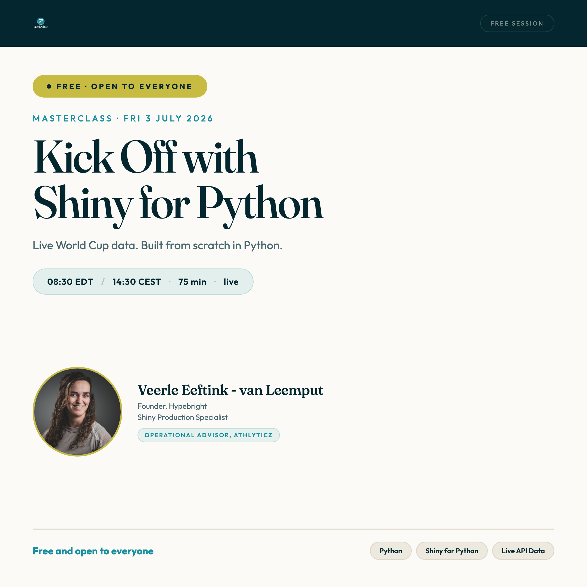
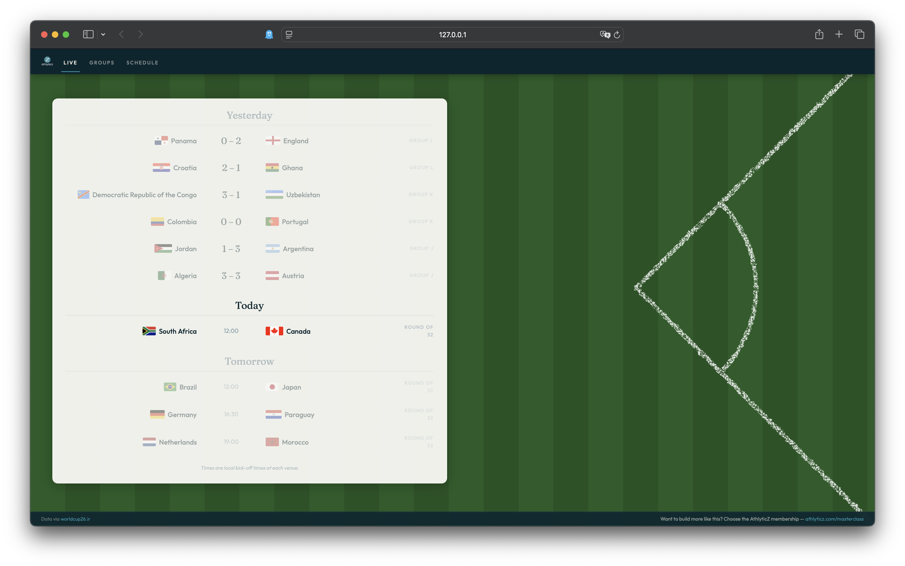
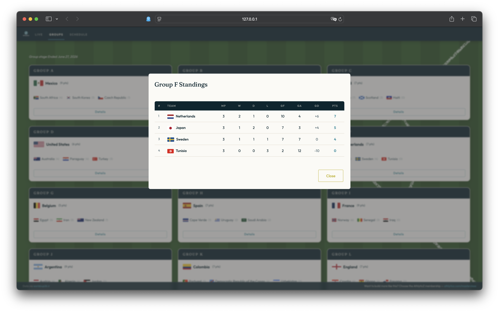
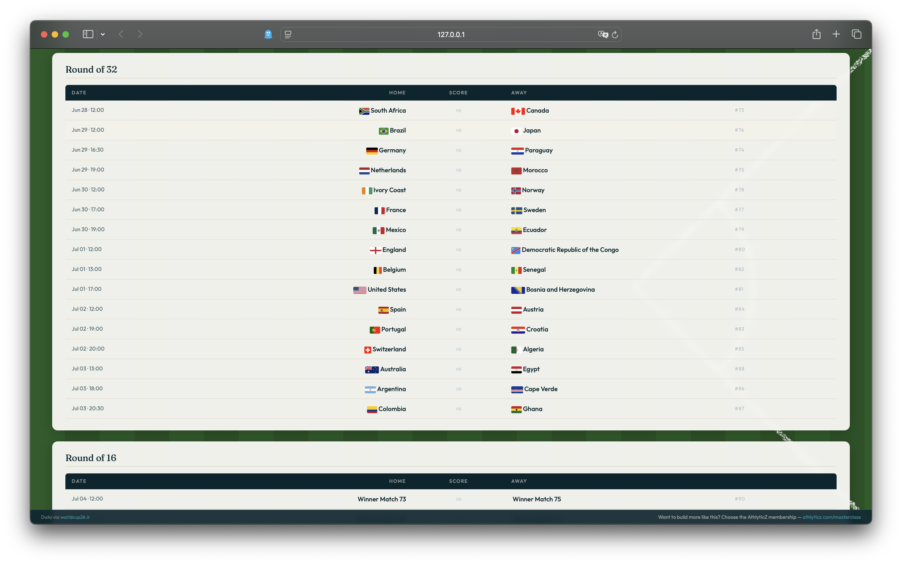

# Kick Off with Shiny for Python



This is the code for the AthlyticZ masterclass on July 3, 2026. In 75 minutes we build a World Cup 2026 dashboard in Python, from scratch 😎⚽️.

**Free and open to everyone.** All the code lives here so you can follow along, go back to it later, or just steal what you need.

---

## What you will build

A live World Cup dashboard with three tabs, pulling from a real REST API with no auth required.

| Tab | What it shows |
|-----|---------------|
| Live | Yesterday, today, and tomorrow's matches with live scores |
| Groups | All 12 groups and final standings |
| Schedule | Every match of the tournament, by phase |

You will build two versions:

- `app/basic.py` - plain and functional, just the logic
- `app/polished.py` - same app, but styled with brand colors, custom fonts, and a football pitch background







---

## What you will learn

- How Shiny for Python works and why it is different from Streamlit or Dash
- The difference between Core and Express syntax (we use Core)
- Setting up a Python project with `uv`
- Calling a REST API with `requests` and working with JSON
- Using `@reactive.calc` to fetch data once and share it across multiple outputs
- Building a multi-tab app with `ui.page_navbar`
- Applying a `_brand.yml` to theme your app consistently
- And of course some extra CSS polish 🤌🏻

---

## But we have LLMs now, right?

Yes. And you should use them.

But if you have never written a Shiny app yourself, you will not know when Claude, or Copilot, or another LLM, gets it wrong. And it does get things wrong. It overshoots, it picks the wrong pattern...

Foundational knowledge is what lets you catch that. You do not need to write every line yourself. You just need to know enough to steer.

That is what this session is about.

---

## Getting started

You need Python and `uv`. If you do not have `uv` yet:

```bash
pip install uv
```

Clone this repo and install dependencies:

```bash
git clone https://github.com/hypebright/kickoff-with-shiny-for-python
cd kickoff-with-shiny-for-python
uv sync
```

Run the basic app:

```bash
shiny run app/basic.py --reload --launch-browser
```

Or the polished version:

```bash
shiny run app/polished.py --reload --launch-browser
```

---

## The API

Data comes from [worldcup26.ir](https://worldcup26.ir), a free and open source World Cup 2026 API. No registration needed.

```
GET /get/teams   - all teams with names and flag URLs
GET /get/groups  - standings for all 12 groups
GET /get/games   - every match with scores, phase, and date
```

---

## Session slides

The slides for the session are in `slides/slides.qmd`. Render them with:

```bash
quarto render slides/slides.qmd
```
---

## Step-by-step walkthrough

In the `teaching-steps` folder you can find 7 "in-progress" files. Each file represents a step, and in 7 steps you can build the basic app step by step. Every new piece of code is commented so you can learn as you go. 

Nobody starts with a complete app (unless you let an LLM handle everything 😉). You start small with a skeleton and build it out. A first API call, a first table, a card, more cards, more details, some CSS tweaks... If you follow the steps it will all be less overwhelming, especially when you're just getting started with programming!

---

Built with [Shiny for Python](https://shiny.posit.co/py/) ⚽️.

Want to build more like this? Check out the [AthlyticZ membership](https://athlyticz.com/masterclass?am_id=veerle1180).

Curious to see the schedule first? Head over to [AthlyticZ scoreboard](https://athlyticz-scoreboard.web.app/guide) 😎.
